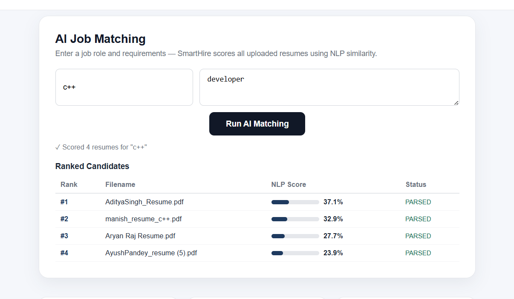
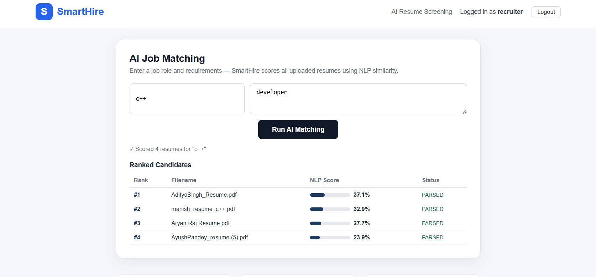

# SmartHire — Full Skeleton (Local Dev)

This bundle includes:
- Backend: Spring Boot (Java 17, Maven)
- ML service: FastAPI + sentence-transformers (+ parsing)
- Frontend: React (CRA)
- PostgreSQL schema and docker-compose for local dev

Quick start with Docker Compose
1. Install Docker & docker-compose.
2. From the extracted project root:
   docker-compose up --build

Services:
- Backend: http://localhost:8080
- ML service: http://localhost:8001
- Frontend (dev server): http://localhost:3000
- Postgres: localhost:5432 (db: smarthire / user: smarthire / pass: smarthire)

Notes:
- First run of the ML service will download a sentence-transformers model and can take time.
- The ML service uses pdfplumber & python-docx for parsing PDFs/DOCX. If pip install fails in Docker, you may need to add system packages (poppler, libxml2, libxslt, build deps). If you hit errors, tell me and I will provide an expanded Dockerfile.
- For development convenience, backend sets `spring.jpa.hibernate.ddl-auto: update`. Use migrations (Flyway/Liquibase) in production.

Parsing demo (curl)
Upload a resume:
curl -v -F "file=@/path/to/resume.pdf" http://localhost:8080/api/resumes

Get parsed resume metadata:
curl http://localhost:8080/api/resumes/1

Next steps I can do for you:
- Provide a git patch instead of a ZIP.
- Generate a PR in your repo (you’ll need to give me repo access or create the repo).
- Convert ML parse endpoint to multipart/form-data (instead of base64).
- Make parsing asynchronous and add status endpoints.

### 📊 Ranked Candidates

Candidates are ranked according to their calculated NLP similarity score.

